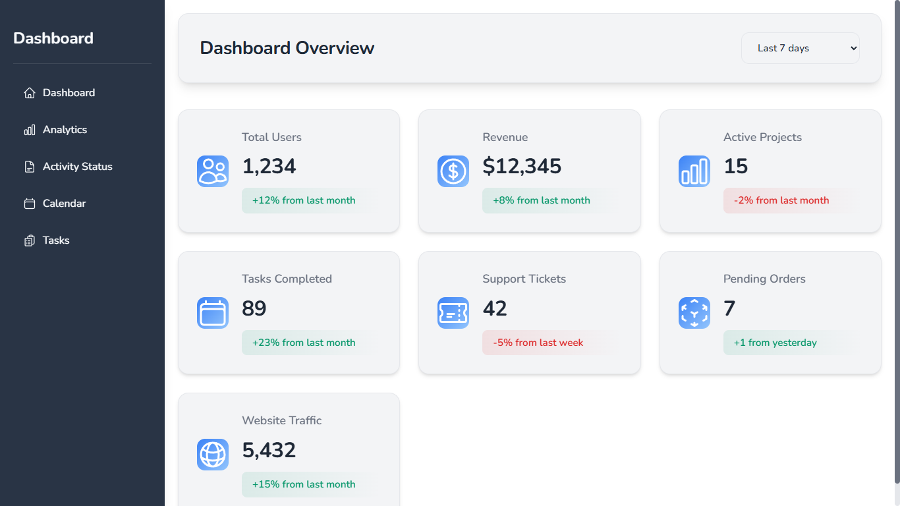

# React Admin Dashboard

A modern, feature-rich admin dashboard built with React, featuring customizable themes, interactive components, and a seamless user experience.



## ✨ Features

### 🎨 Theme Customization
- Light and dark mode support
- Customizable color schemes
- Consistent design system
- Smooth theme transitions

### 📊 Interactive Components
- **Data Tables**
  - Sortable columns
  - Pagination
  - Search functionality
  - Responsive design

- **Charts**
  - Multiple chart types
  - Real-time data updates
  - Interactive tooltips
  - Customizable themes

- **Calendar**
  - Event management
  - Multiple views (month/week)
  - Event categories
  - Add/Edit events modal

- **Kanban Board**
  - Drag and drop functionality
  - Task management
  - Priority levels
  - Column customization

## 🚀 Getting Started

### Prerequisites
- Node.js (v14 or higher)
- npm or yarn

### Installation

1. Clone the repository
```bash
git clone https://github.com/yourusername/react-admin-dashboard.git
```

2. Install dependencies
```bash
cd react-admin-dashboard
npm install
```

3. Start the development server
```bash
npm run dev
```

4. Open [http://localhost:5173](http://localhost:5173) in your browser

## 🛠️ Built With

- [React](https://reactjs.org/) - Frontend framework
- [Vite](https://vitejs.dev/) - Build tool
- [FullCalendar](https://fullcalendar.io/) - Calendar component
- [Chart.js](https://www.chartjs.org/) - Charting library
- Custom CSS with CSS Variables - For theming and styling
- CSS Modules - For component-specific styles

## 📁 Project Structure

```
src/
├── components/         # Reusable components
│   ├── Calendar/      # Calendar component
│   ├── Charts/        # Chart components
│   ├── KanbanBoard/   # Kanban board component
│   ├── Sidebar/       # Navigation sidebar
│   └── datatables/    # Data table components
├── pages/             # Page components
├── assets/            # Static assets
└── styles/            # Global styles
```

## 🎯 Features in Detail

### Theme System
- CSS variables for consistent theming
- Custom color schemes
- Dark mode support
- Smooth transitions

### Data Tables
- Sortable columns
- Pagination
- Search functionality
- Responsive design
- Customizable columns

### Charts
- Line charts
- Bar charts
- Pie charts
- Area charts
- Interactive tooltips

### Calendar
- Month and week views
- Event management
- Event categories
- Add/Edit events
- Event reminders

### Kanban Board
- Drag and drop
- Task management
- Priority levels
- Column customization
- Task labels

## 🎨 Customization

### Theme Colors
```css
:root {
  --primary-color: #4f46e5;
  --success-color: #059669;
  --warning-color: #d97706;
  --error-color: #dc2626;
  --info-color: #0284c7;
}
```

### Component Styling
All components use CSS variables for consistent styling and easy customization.

## 📱 Responsive Design
- Mobile-first approach
- Responsive layouts
- Touch-friendly interfaces
- Adaptive components

## 🔧 Development

### Available Scripts

```bash
npm run dev          # Start development server
npm run build        # Build for production
npm run preview      # Preview production build
npm run lint         # Run ESLint
```

### Code Style
- ESLint for code linting
- Prettier for code formatting
- Consistent component structure

## 🤝 Contributing

1. Fork the repository
2. Create your feature branch (`git checkout -b feature/AmazingFeature`)
3. Commit your changes (`git commit -m 'Add some AmazingFeature'`)
4. Push to the branch (`git push origin feature/AmazingFeature`)
5. Open a Pull Request

## 📝 License

This project is licensed under the MIT License - see the [LICENSE](LICENSE) file for details.

## 🙏 Acknowledgments

- [React](https://reactjs.org/)
- [Vite](https://vitejs.dev/)
- [FullCalendar](https://fullcalendar.io/)
- [Chart.js](https://www.chartjs.org/)

## 📞 Contact

Your Name - [Sai Gonga]
Project Link: [https://github.com/yourusername/react-admin-dashboard](https://github.com/yourusername/react-admin-dashboard)
